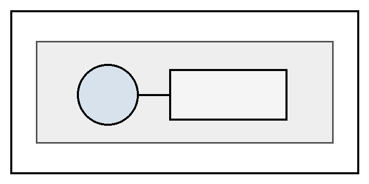
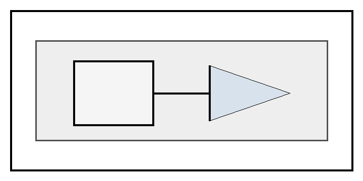

# 范围

本文件展示图题、表题以及附录图题、附录表题使用 Word 样式自动编号后的交叉引用效果。

正文引用应显示为：见{{tbl:body-table:label}}、{{tbl:body-table:full}}、编号{{tbl:body-table}}；见{{fig:body-figure:label}}、{{fig:body-figure:full}}、编号{{fig:body-figure}}。

# 正文图表示例

{表：#tbl:body-table} 正文表题

| 项目 | 值 |
| --- | --- |
| A | 1 |
| B | 2 |

# 附录 规范性 图表引用附录

附录引用应显示为：见{{tbl:appendix-table:label}}、{{tbl:appendix-table:full}}、编号{{tbl:appendix-table}}；见{{fig:appendix-figure:label}}、{{fig:appendix-figure:full}}、编号{{fig:appendix-figure}}。

{表：#tbl:appendix-table} 附录表题

| 项目 | 值 |
| --- | --- |
| A | 1 |
| B | 2 |

# 参考文献

GB/T 1.1—2020  标准化工作导则  第1部分：标准化文件的结构和起草规则
